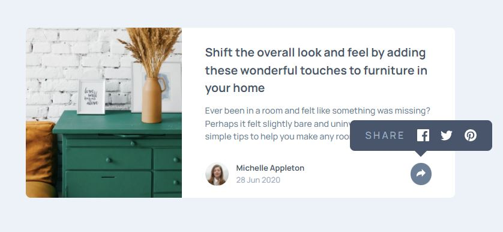
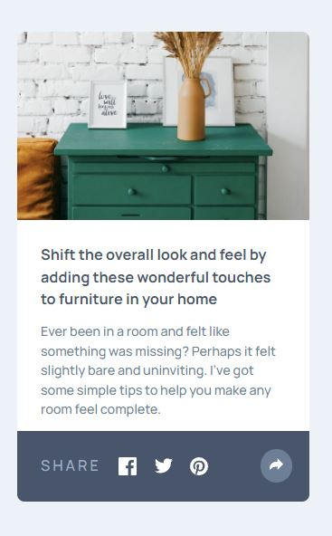

# Frontend Mentor - Article preview component solution

This is a solution to the [Article preview component challenge on Frontend Mentor](https://www.frontendmentor.io/challenges/article-preview-component-dYBN_pYFT). Frontend Mentor challenges help you improve your coding skills by building realistic projects.

## Table of contents

- [Overview](#overview)
  - [The challenge](#the-challenge)
  - [Screenshot](#screenshot)
  - [Links](#links)
- [My process](#my-process)
  - [Built with](#built-with)
  - [What I learned](#what-i-learned)
  - [Continued development](#continued-development)
- [Author](#author)

## Overview

### The challenge

Users should be able to:

- View the optimal layout for the component depending on their device's screen size
- See the social media share links when they click the share icon

### Screenshot

### Links

- Solution URL: [https://github.com/Robert-Rynard/article-preview-react](https://github.com/Robert-Rynard/article-preview-react)
- Live Site URL: [https://robert-rynard.github.io/article-preview-react/](https://robert-rynard.github.io/article-preview-react/)

## My process

### Built with

- Semantic HTML5 markup
- CSS custom properties
- CSS Modules
- Flexbox
- Mobile-first workflow
- [React](https://reactjs.org/) - JS library

### What I learned

Through this challenge I was able to learn and practice how to implement animations with react and using the useState hook. Most of the animations I have made before this were using CSS only so it was a good experience implementing it with JavaScript as well.

### Continued development

Going forward I would like to implement more animations to the sites I make. I would also like to tackle projects that challenge me to use more of my React and JavaScript skills.

## Author

- Website - [Robert Rynard](https://github.com/Robert-Rynard)
- Frontend Mentor - [@Robert-Rynard](https://www.frontendmentor.io/profile/Robert-Rynard)
- Twitter - [@robert_rynard](https://www.twitter.com/robert_rynard)
